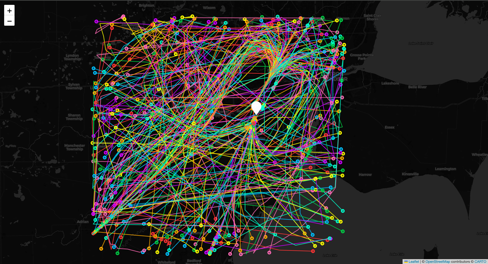
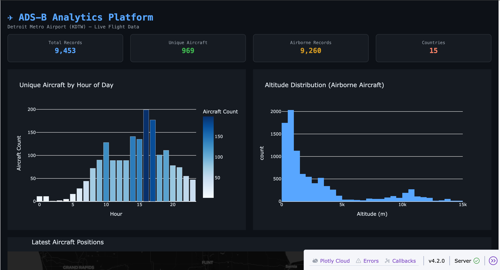

# ✈ ADS-B Aviation Analytics Platform

A real-time data engineering, analytics, machine learning, and security
platform built on live ADS-B aircraft tracking data around
**Detroit Metropolitan Wayne County Airport (KDTW)**.

This project ingests live aircraft position data, stores it in a
PostGIS-enabled PostgreSQL database, and layers analytics, ML models,
and a security detector on top — all built from scratch over the course
of a few days using the free [OpenSky Network](https://opensky-network.org/) API.

---

## 🗺 Live Flight Paths Around KDTW



301+ real aircraft trajectories captured live, visualized with Folium.
You can clearly see approach/departure corridors converging on KDTW
(white marker) and aircraft transiting the wider Detroit airspace.

## 📊 Live Analytics Dashboard



A live Dash web app showing real-time stats, hourly traffic patterns,
altitude distributions, and current aircraft positions — refreshing
automatically every 60 seconds.

---

## Architecture
OpenSky API  ->  Ingestion  ->  PostgreSQL/PostGIS  ->  Analysis  ->  Dashboard

|

+-->  ML models (anomaly / congestion / clustering)

+-->  Security (spoofing detection)

## Project Layout
adsb-analytics/

├── src/

│   ├── ingestion/    # OpenSky API client + scheduler

│   ├── analysis/     # stats, flight paths, separation, routing efficiency

│   ├── models/       # anomaly detection, congestion prediction, clustering

│   ├── security/      # ADS-B spoofing detection

│   └── dashboard/     # live Dash web app

├── docs/             # screenshots, generated maps

├── sql/              # database schema

└── requirements.txt

---

## Features

### 1. Real-Time Data Pipeline
- Pulls live aircraft state vectors from the OpenSky Network API every 60 seconds
- Stores data in PostgreSQL with PostGIS for spatial queries
- Fully automated scheduler — runs continuously, building a growing dataset

### 2. Core Analytics
- Busiest hours, altitude distributions, airborne vs. on-ground ratios
- Individual flight path reconstruction
- Interactive map visualization of all tracked aircraft

### 3. Separation & Routing Analysis
- Calculates real-time separation between aircraft pairs using PostGIS
- Flags pairs below ICAO separation minimums (5nm horizontal / 1000ft vertical)
- Measures routing efficiency (straight-line vs. actual distance flown)

### 4. Machine Learning Layer
- **Anomaly detection** (Isolation Forest) — flags unusual flight behavior
- **Congestion prediction** (Random Forest) — predicts traffic density by time of day
- **Flight clustering** (K-Means) — groups aircraft into behavioral categories
  (transit traffic, approach/departure, training/pattern flights, etc.)

### 5. ADS-B Spoofing Detection
- Flags physically impossible speeds, climb rates, and altitudes
- Detects "position jumps" — aircraft appearing to move faster than physically possible
- Includes honest analysis of false positives vs. real anomalies vs. sensor noise

---

## Key Findings

- KDTW's busiest period is consistently the **afternoon (4–5pm)**, with traffic
  building from a morning ramp-up starting around 6am
- Flight behavior clustering cleanly separated **training/pattern aircraft**
  (low altitude, low routing efficiency, lots of turns) from **commercial
  approach/departure traffic** and **high-altitude transit flights**
- Most "impossible altitude" anomalies traced back to **ADS-B sensor glitches**
  rather than genuine threats — a real challenge in ADS-B security work is
  separating noise from actual spoofing

---

## Setup

```bash
# Clone the repo
git clone https://github.com/Tekz-44/adsb-analytics.git
cd adsb-analytics

# Set up environment
python3 -m venv venv
source venv/bin/activate
pip install -r requirements.txt

# Configure credentials
cp .env.example .env   # then fill in OpenSky + DB credentials

# Set up the database
psql postgres -c "CREATE DATABASE adsb;"
psql adsb -f sql/schema.sql

# Start collecting data
cd src/ingestion
python scheduler.py
```

## Running the Dashboard

```bash
python src/dashboard/app.py
```

Then open `http://127.0.0.1:8050`

---

## About

Built by Victor Tekigerwa — CS student, private pilot, and aviation
data enthusiast. This project sits at the intersection of data
engineering, machine learning, and aviation operations.

[LinkedIn](https://www.linkedin.com/in/victor-tekigerwa-555054231?jobid=1234&lipi=urn%3Ali%3Apage%3Ad_jobs_easyapply_pdfgenresume%3BstuVkAnrTpy8NvgB0ZM2WA%3D%3D&licu=urn%3Ali%3Acontrol%3Ad_jobs_easyapply_pdfgenresume-v02_profile) | [GitHub](https://github.com/Tekz-44)